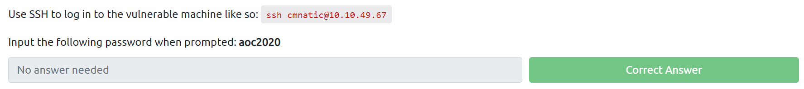
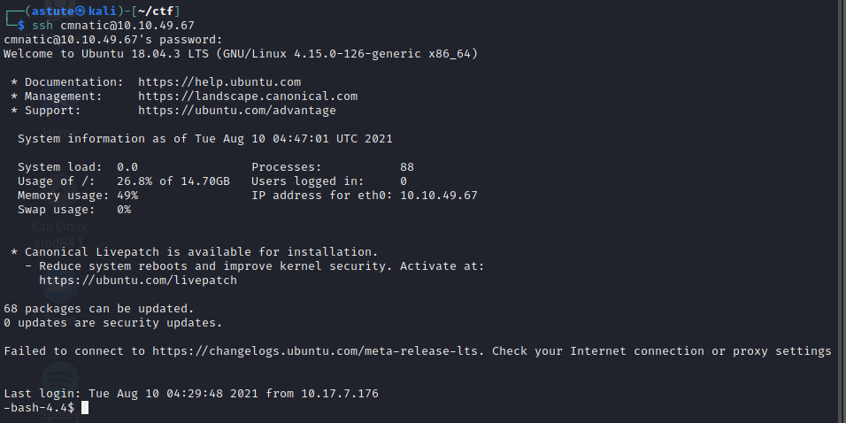
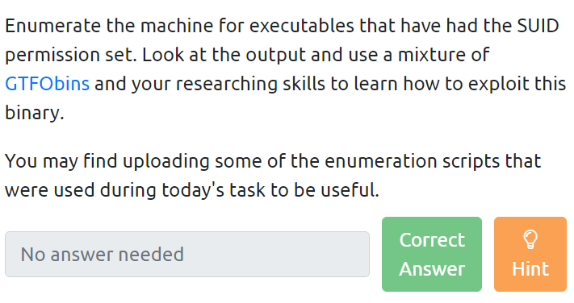
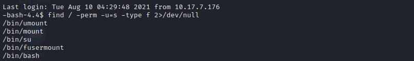
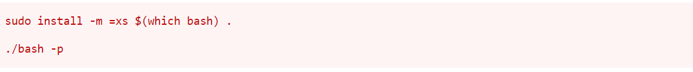
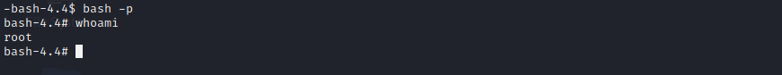
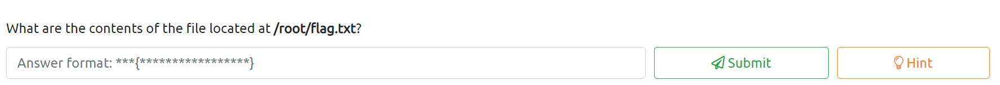
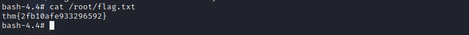

# **_adventofcyber2 Day 11 (privilege escalation)_**

    https://tryhackme.com/room/adventofcyber2

-------------------------------------------------------------
`Hope you went through the thoery well`
`if so then let's get started`

    vetical

------------------------------------------------------------

    sudoers

----------------------------------------------------------------
`first two questions are totally theory based right`
`but it is more useful later`

`Let's do what it says`
`seems easy just we have to do ssh login with that password`

`we logined in successfully`

--------------------------------------------------------------

`Now it's fun part`
`time to enumerate the machine`

`we can do it on many different ways , one is to upload some script to the machine`
`but i am gonnna use another one , let's start`

`first we are gonna do search who has SUID permission`

    find / -perm -u=s -type f 2>/dev/null

`we are getting much of information that has SUID permission`
`But I am interested on /bin/bash`

`Let's see what permission it has with command `

    ls -la /bin/bash

![img_6.png]Images/(img_6.png)

`seems we have root access now`

`Time to use GTFOBins`
`I personally use  this for security flaws most of the time`

    https://gtfobins.github.io/

`we know that /bin/bash has root access , now search bash on GTFObins and select SUID`

`you can find something like this on SUID section`
`Time to use flaws`
`Run below command on SSH terminal now `

    ./bash -p

`now let's check our access using command:`

    whoami

`Yoo! we are root now`

`let's see our last question`

`since we are root now , we have all the permission`
`let's have a look into it `

    cat /root/flag.txt

    thm{2fb10afe933296592}

------------------------------------------------------------
# *_Thank You_*