    https://tryhackme.com/room/adventofcyber2 Day 6
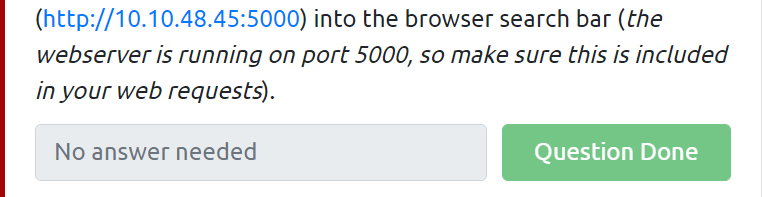

    nivigate to {machineip:5000} where web server is running

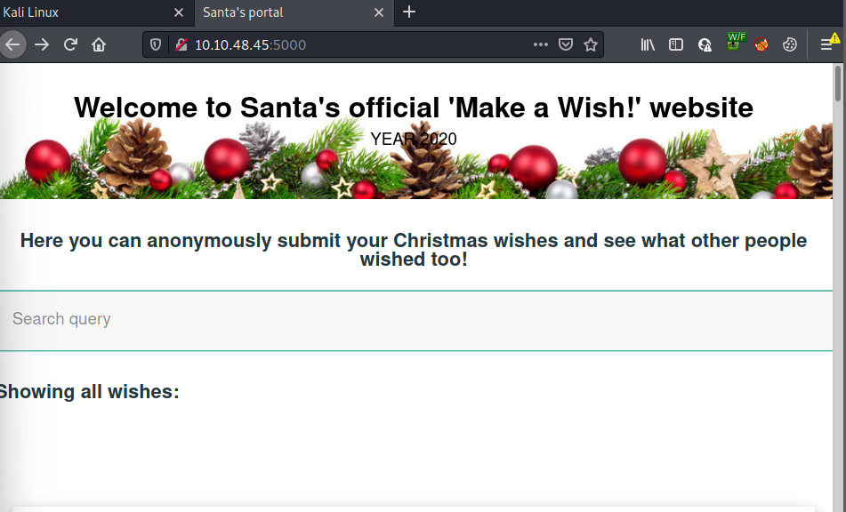

    since we can interact with query and comment so it is clear that it is stored XSS
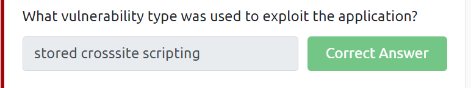

    => stored crosssite scripting
-------------------------------------------------
    now enter {anything} on query on make wish and also notice the url that has been modified now

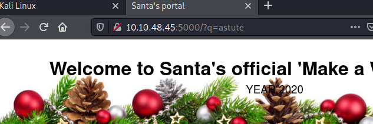

    you can see /q={anything} on url so we got our answer
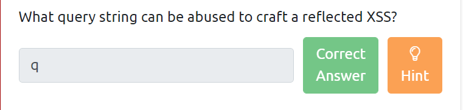

    now lauch the ZAP application that is available by default in kali linux

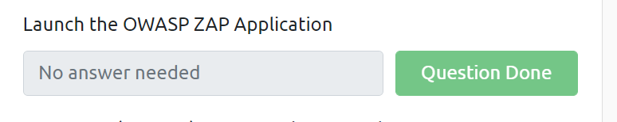

    once you open the zap on automatic search option ,paste the url of site {machineip:5000} and hit enter on attack button
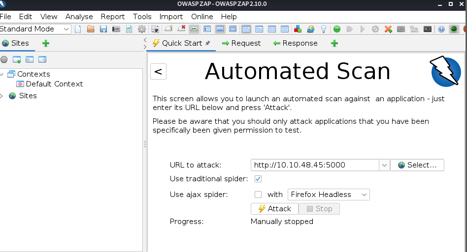

    on botton of zap application you can see alert section 

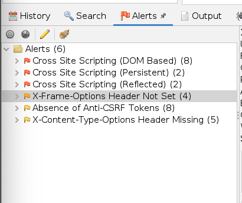

    now we can see 3 red flag which means 3 alert 
    yoo! we got our answer 
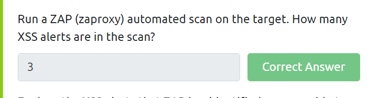

    => 3

-----------------------------------------------------
    on wish page type  to popup 1 
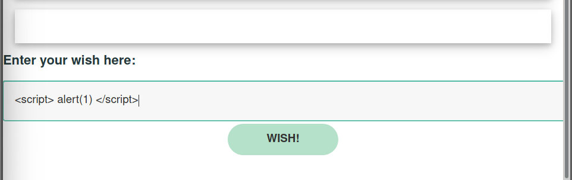

    you will get poped up 1 on your screen 

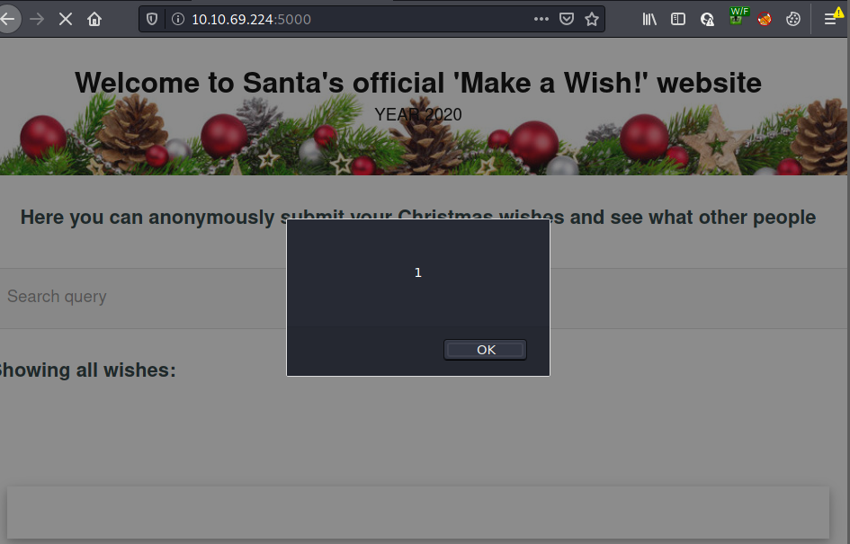

    yoo! we also did our last task 
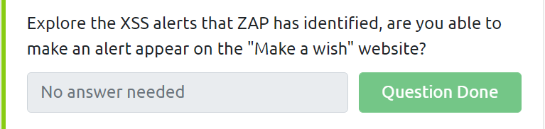

    --------Thank You---------
