# *_adventofcyber2 Day 7 (wireshark)_*
    https://tryhackme.com/room/adventofcyber2
`download the attached file and unzip it with command:`

    unzip aoc-pcaps.zip     

`you will be getting 3 file `

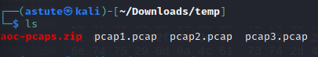

`now open wireshark application and open pcap1.pcap with wireshark`
`as per question we are going to search ICMP associated IP`

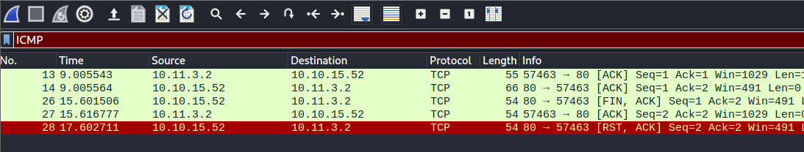

`search ICMP on search bar and you will get initiated IP`

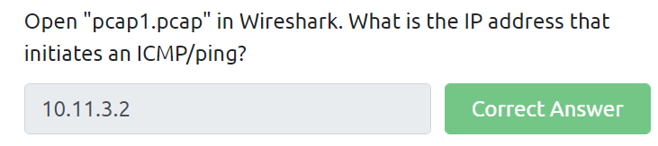

    10.11.3.2
------------------------------------------------------

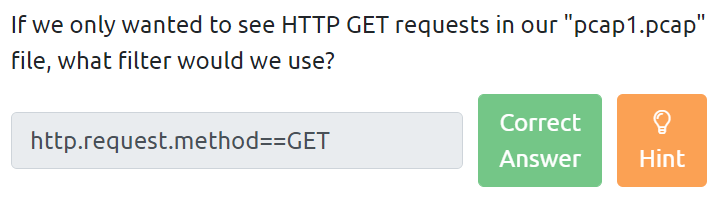
`answer is easy and you should know this before starting wireshark`

    http.request.method==GET
-----------------------------------------------
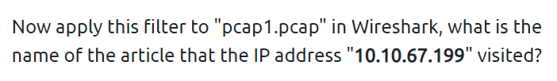

`this is some manual work try using HINT`

`from Hint it is clear that it is post request from HTTP`
`so I tried to mannual check HTTP reqeust from that IP and found on package 69`

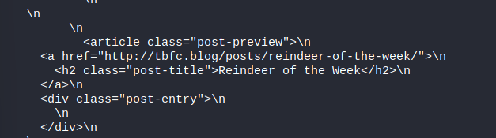

`we got our answer on posts request`

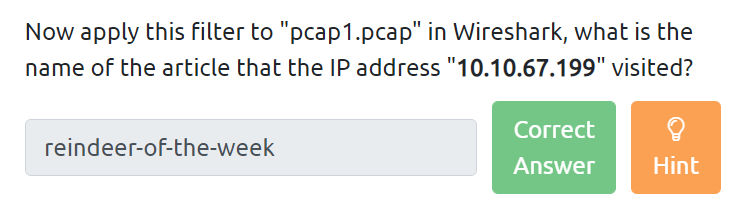

    reindeer-of-the-week

------------------------------------------------------------------
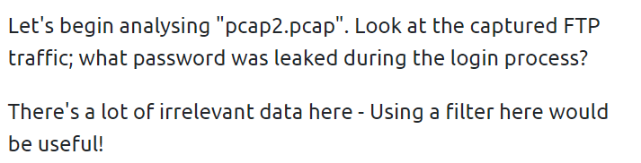

`let's open our another file ie pcap2.pcap`
`since there is too much unwanted info so we are using HINT`

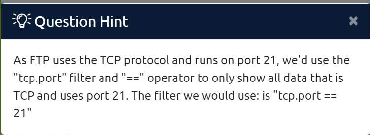

`Hint made this too easy `
`now just run that command on search`

    tcp.port = 21
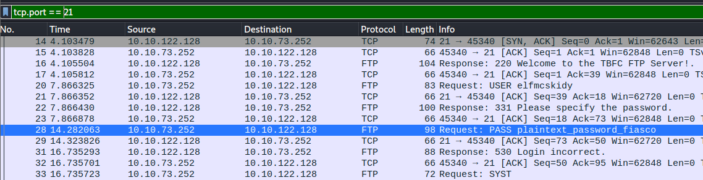    

`on packet 28 we got our answer`

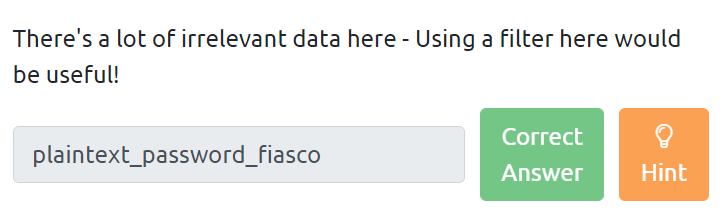

    plaintext_password_fiasco
-------------------------------------------------------

`now let's search for tcp port 22`
    
    tcp.port = 22

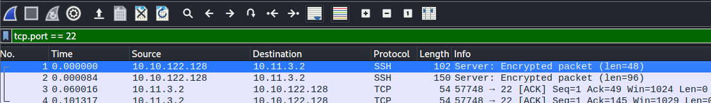

`we are getting ecryption on SSH`

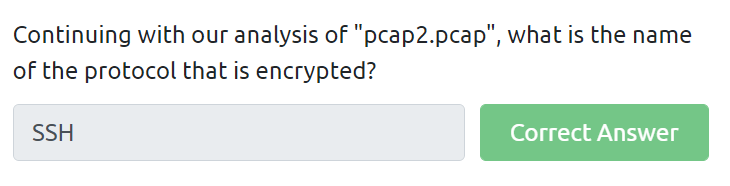

    SSH
-------------------------------------------------

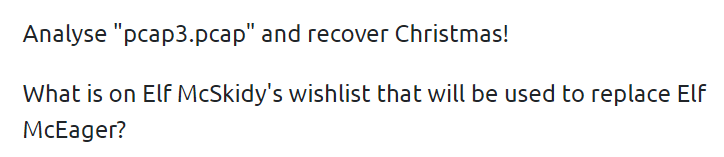

`now open pcap3.pacp and search`
    
    tcp.stream eq 4

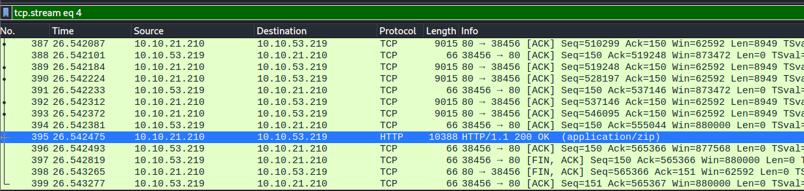

`select the (application/zip) file`
`then click on `
`file >`
`export object >`
`http >`
`and save and unzip it again`

 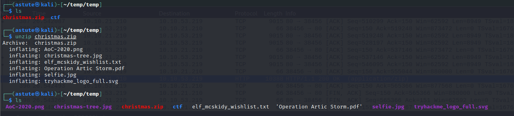

`once you unzip open the elf_mcskidy_wishlist.txt file`

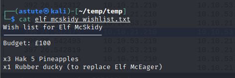

`we got our last answer too`

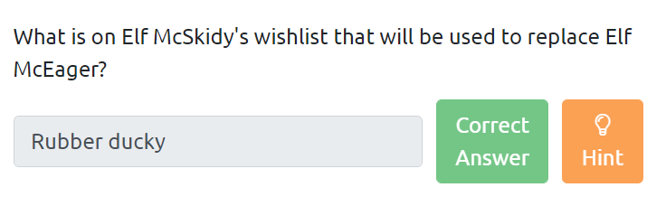

    Rubber ducky 

# **_Thank You_**