# **_adventofcyber2 Day 8_** 

    https://tryhackme.com/room/adventofcyber2

`The first question is totally research based`
`Use google to find answer `

    1998
_________________________________________________________
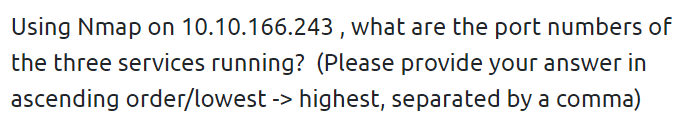

`use a simple Nmap scan on the machine ip `

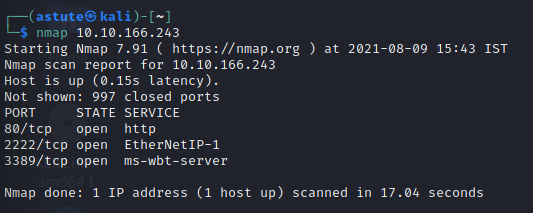

    nmap {machine ip}

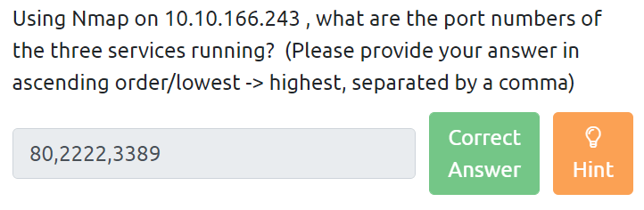

    80,2222,3389
-----------------------------------------------
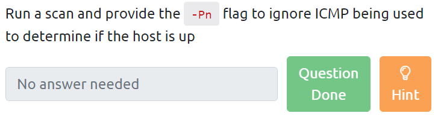

    nmap -Pn {machine IP}

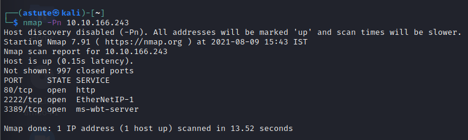

------------------------------------------------------
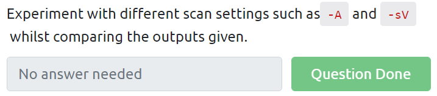

`Lets use -A and -Sv`
`this is most used scan that I use`
    
    nmap -sV -A {machine IP}

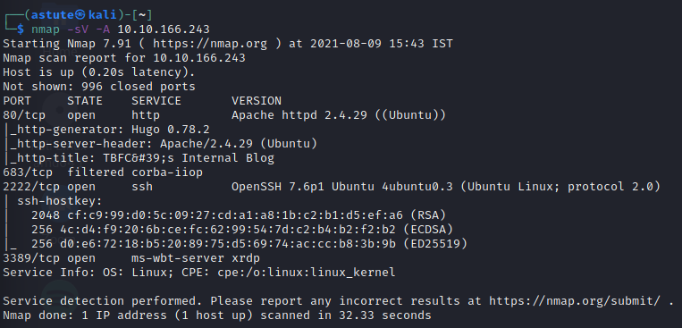

----------------------------------------------------------
`let's look deeply on the scan result`

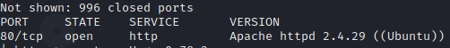

`you can find the linux distribution on that scan itself`

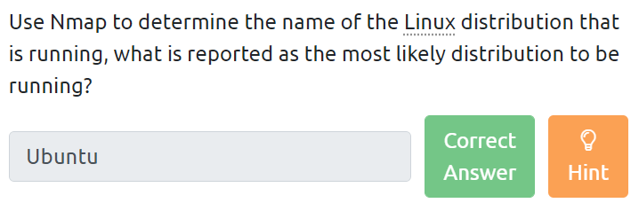

    Ubuntu

-------------------------------------------
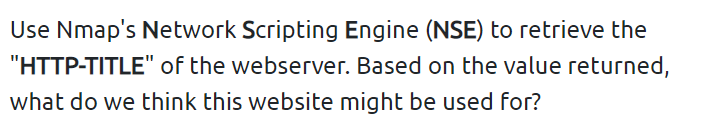

`On the same scan look closely to HTTP Title section you can find answer there`

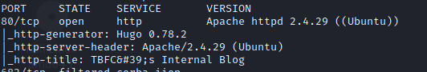

`we got our answer Internal Blog`

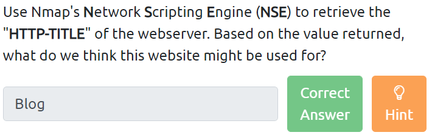

    Blog

----------------------------------------------------
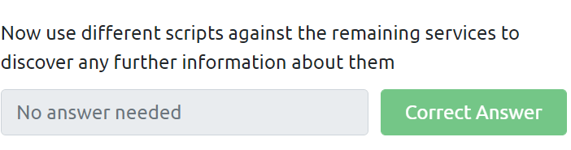

`Let's scan with any on NSE`
`Let's scan with --script vuln`

    nmap --script vuln {machine IP}

`yoo! We did our last Question `

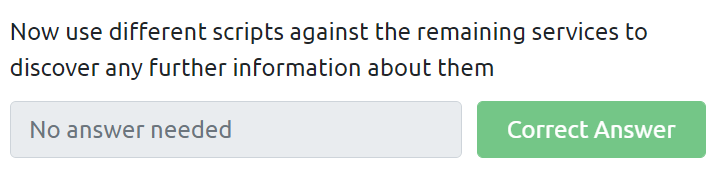

#                 _*Thank You*_ 
