# _**adventofcyber2 Day 10 (enum4linux + smbclient)**_

    https://tryhackme.com/room/adventofcyber2

`enum4linux.pl , you can find it on /usr/share/enum4linux/`
    
    ./enum4linux.pl -h

`use this command to know more about it`

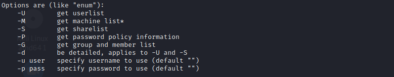

`we will be using -U and -S for this room`

--------------------------------------------------------
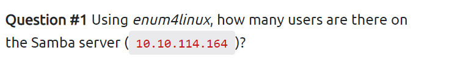

`now run enum scan for users available on that IP using below code: `

    ./enum4linux.pl -U {machine IP}

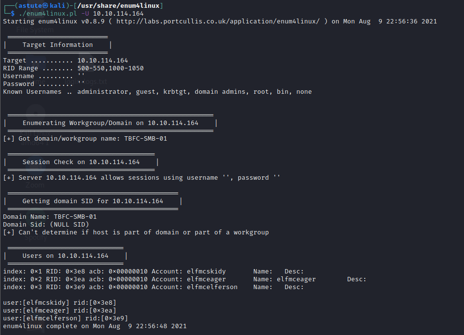

`now you can see 3 users `
`let's go !`

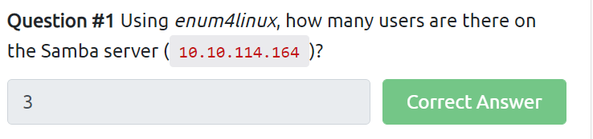

    3
____________________________________________________________
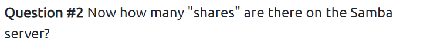

`let's use another enum4linux scan `
    
    ./enum4linux -S {machine IP}

`note be on directory = /usr/share/enum4linux/ before code execution`

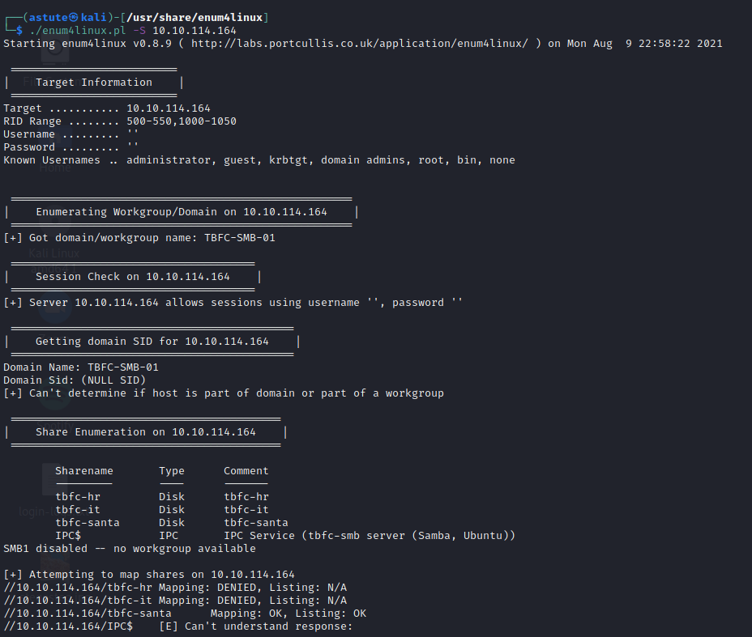

`Let's look closely to the sharename `

    4
-------------------------------------------------------------
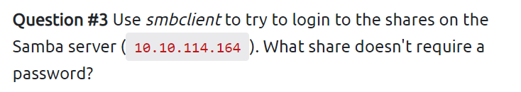

`use smbclient for this which is inbuilt fuction in kali linux`

`we have 4 usershare name let's use one by one`
`luckly on tbfc-santa , it has no password`

    smbclient //{machine IP}/tbfc-santa

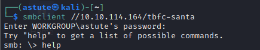

`you can try help command to know more about smbclient`

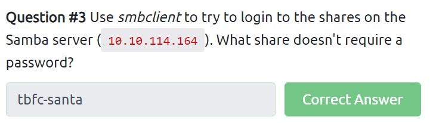

    tbfc-santa

------------------------------------------------------------
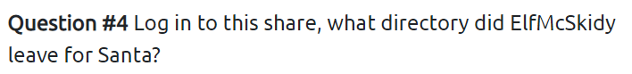

`on smbclient terminal try seeing lists using ls command`

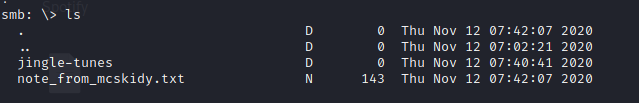

`We can see 2 dictory in which one of it is our answer`

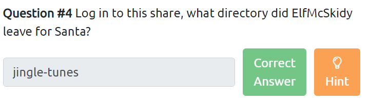

    jingle-tunes

----------------------------------------------------------

# _**Thank You**_
    